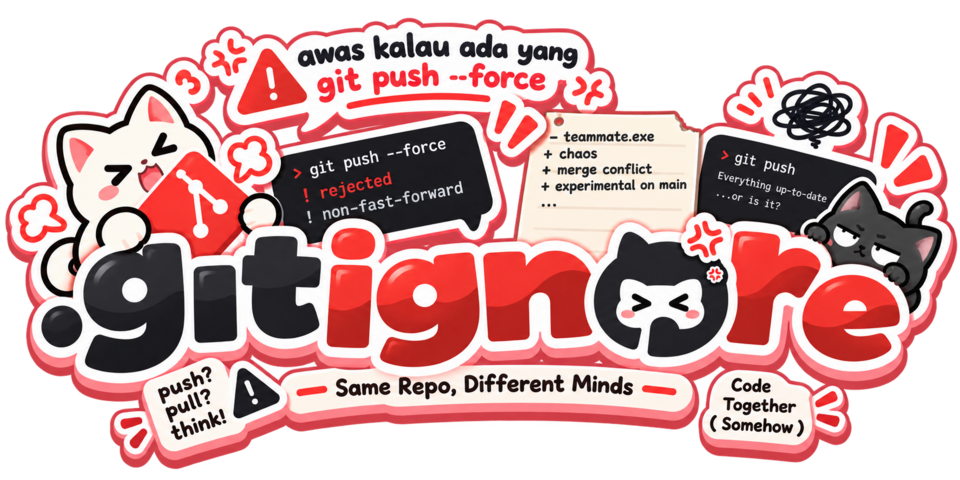

  
  
  
  

> I like Linux, DevOps and artificial intelligence.

I'm interested in understanding how things work
under the hood and building things just for the sake
of learning.

##  What I do

-  Linux & system administration
-  DevOps & self-hosting
-  AI experiments
-  Bash/Linux scripts project
-  Rooting Phone & Jailbreaking
-  Linux's init experiments
-  Homelabbing
-  Make/contribute open source project(s)

##  Projects

-  **[Bellbound](https://github.com/bluebleaze/Bellbound)**
-  **[ruby-tools](https://github.com/bluebleaze/ruby-tools)**
-  **[bluebleaze.github.io](https://github.com/bluebleaze/bluebleaze.github.io)**
-  **[IOnLearn](https://github.com/bluebleaze/IOnLearn)**

## .gitignore team
  
 
    
  

  

### Chaotic Team that exist <i>somehow...</i>
- [bluebleaze](https://github.com/bluebleaze) 
- [inihelta](https://github.com/inihelta) 
 

##  Currently learning

`Linux` `Networking` `DevOps` `AI` `Systems` `Bash` `Open Source`

> I use Artix Btw(im a larp)
